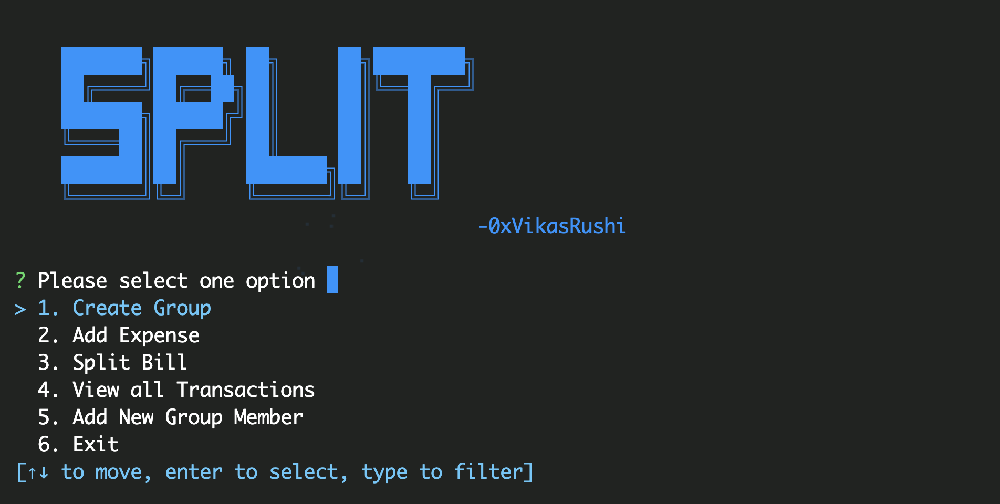

# Splitise cli


It allows users to create groups, add expenses, view transactions, add new group members, and efficiently split bills among group members.

## Features

- **1. Create Group**: Create a new group by adding members.
- **2. Add Expense**: Add expenses to the group, specifying the payer and the recipients.
- **3. View Transactions**: View all the transactions made within the group.
- **4. Add New Group Member**: Add a new member to an existing group.
- **4. Split Bill**: Automatically split bills among group members based on their individual expenses and payments.

## Installation

1. Clone this repository to your local machine:

   ```bash
   git clone https://github.com/0xvikasrushi/splitwise-rust
   ```

2. Navigate to the project directory:

   ```bash

   $ cd splitwise-rust
   ```

3. Compile the project:

   ```bash
   $ cargo build
   ```

4. Run Sample Test

   ```bash
   $ cargo test
   ```

## Usage

Once the project is compiled, you can run the CLI using the following command:

```bash
cargo run
```

### Commands

1. **Create Group**: Allows you to create a new group by adding members.
2. **Add Expense**: Add expenses to the group. Specify the payer and the recipients, along with the amount.
3. **View Transactions**: View all the transactions made within the group.
4. **Add New Group Member**: Add a new member to an existing group.
5. **Split Bill**: Automatically split bills among group members based on their individual expenses and payments.
6. **Exit**: Exit the CLI.

## Example
<video src="https://github.com/0xVikasRushi/splitwise-rust/assets/88543171/c112bd5f-1848-4ce8-a121-4548dbacd24e" autoplay muted loop controls></video>
